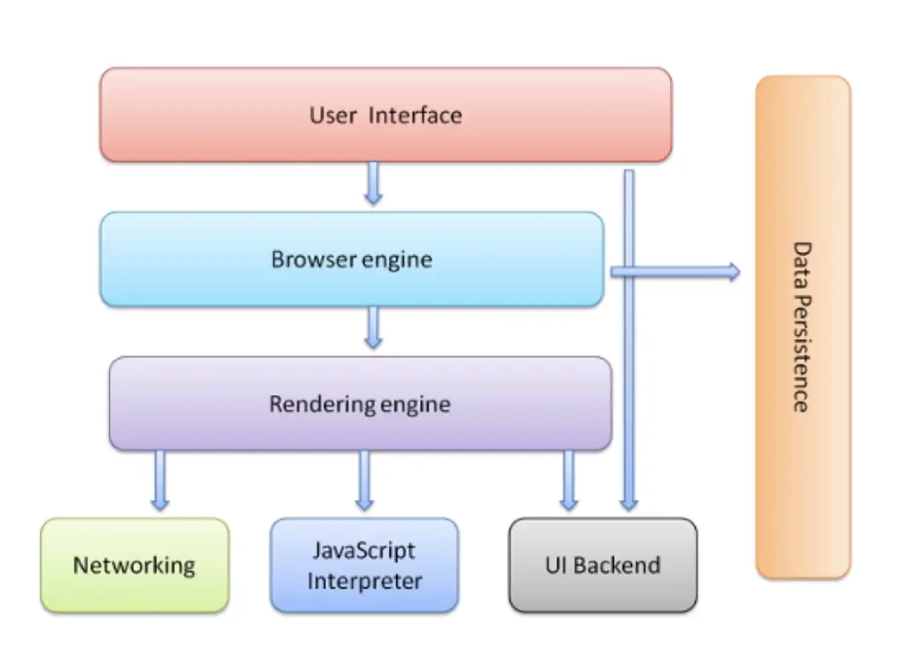

# Learning Objectives -  Browser Basics

- Explain the difference between the BOM (browser object model) and the DOM(document object model).
  1. The DOM is the API used to access the elements inside the document
  2. The BOM is a larger representation of everything provided by the browser, including the current document
  - DOM(Document Object Model):
    - Interface that allows us to dynamically access and update the content, structure and style of a website
    - JS is the client-side scripting language that connects to the DOM in a browser
    - Defines HTML elements as objects and gives them properties, methods, and events
  - BOM(Browser Object Model):
    - Larger representation of everything provided by the browser, including the current document, location, history, frame, and any other functionality the browser may expose to JS.
    - 
- Given a diagram of all the different parts of the browser, identify each part.
  - 

- Use the Window API to change the innerHeight of a user's window.
- Identify the context of anonymous functions running in the browser (the window).
- Given a JS file and an HTML file, use a script tag to import the JS file and execute the code therein when all the elements on the page load.
- Explain the browser's main role in the request/response cycle.
- Identify, examine, and delete cookies for a given website using the Chrome Developer Tools.
